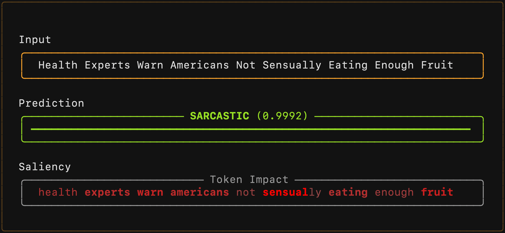

# The Impact of Parameter Count on Sarcasm Detection Using BERT-Based Models

This repository contains the source code and results for the experiments presented in *The Impact of Parameter Count on
Sarcasm Detection Using BERT-Based Models*.

## Installing Dependencies

**Requirements:** Python 3.13 (or a compatible Python version)

Create and activate a virtual environment (optional but recommended). Then install the required dependencies:

```sh
pip install --upgrade pip
pip install -r requirements.txt
```

## Running Experiments

To run an experiment, you can use the following example and adjust parameters as needed. A simple bash script for
running experiments can be found under [scripts/run-experiment.sh](scripts/run-experiment.sh).

```sh
python -m src.main \
  --seed 1 \
  --dataset news_headlines \
  --pretrained-model-name prajjwal1/bert-tiny \
  --classification-head bert_single_token_attention \
  --dropout-p 0.1 \
  --train-test-split 0.7 \
  --batch-size 32 \
  --learning-rate 2e-5 \
  --max-grad-norm 1.0 \
  --num-train-epochs 5 \
  --experiment-name my-experiment \
  --save-model
```

## Experiment Scripts

The main experiments were conducted using the following scripts:

**Grid Search** ([scripts/grid-search.sh](scripts/grid-search.sh)): Evaluates a range of learning rates and batch sizes
for five BERT-based models on three datasets. Results are saved to [results/logs/grid_search_*/](results/logs).

**Multi-Seed Evaluation** ([scripts/evaluation.sh](scripts/evaluation.sh)): Repeats each model–dataset combination ten
times (seeds 1–10) using the best batch size and learning rate selected from the grid search to obtain robust evaluation
results. Results are saved to [results/logs/evaluation_*/](results/logs).

## Inference App

Interactive terminal app for exploring trained models with real-time predictions and token saliency visualization.



### Usage

```sh
python inference-app.py --path <path-to-model> --device <device>
```

**Arguments:**

- `--path`: Path to trained model file (required)
- `--device`: PyTorch device (default: `cpu`)

The app loads the model configuration from the experiment logs.

Trained models are available on
Zenodo: [https://doi.org/10.5281/zenodo.18331394](https://doi.org/10.5281/zenodo.18331394)
